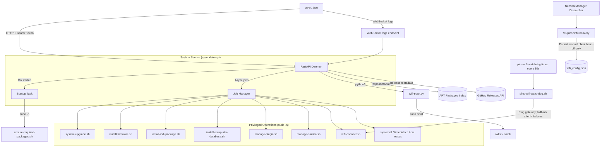

# PINS Daemon (System Management API)

A lightweight, secure, Python-based daemon designed for the Raspberry Pi to expose system management capabilities via a REST API. It handles system updates, firmware installation, Samba share management, PHD2 service control, Wi-Fi configuration, and system telemetry/time operations.

## Features

- **System Updates**: Trigger the packaged, systemd-backed PINS upgrade workflow remotely.
- **Firmware Management**: Upload versioned firmware archives and install contained `.deb` packages asynchronously.
- **ASTAP Star Database Management**: List and install supported ASTAP star databases (D50, D05, G05, W08) for Raspberry Pi 64-bit.
- **Samba Management**: Enable or disable SMB shares for file access.
- **PHD2 Management**: Check and control `phd2` service state.
- **Wi-Fi Management**: Scan for available networks, connect securely, configure auto-connect, and inspect current connection status.
- **Wi-Fi Runtime Recovery**: Retries the configured client interface when connectivity
  is lost and falls back to the device hotspot after repeated failures.
- **System Utilities**: Read Pi temperature, read system time, and set system time.
- **Secure Architecture**:
  - Runs as a restricted user (`sysupdate-api`).
  - No shell injection: Commands are hard-coded or strictly parameterized.
  - Privileges delegated via `sudoers` (no root API access).
  - Bearer Token authentication.
- **Real-time Feedback**: WebSocket endpoint for streaming command execution logs.

## High-Level Design


```mermaid
graph TD
  Client[API Client] -->|HTTP + Bearer Token| API[FastAPI Daemon]
  Client -->|WebSocket logs| WS[WebSocket logs endpoint]
  WS --> API

  subgraph "System Service (sysupdate-api)"
    API
    Startup[Startup Task]
    JobMgr[Job Manager]
  end

  API -->|On startup| Startup
  Startup -->|sudo -n| EnsureReq[ensure-required-packages.sh]

  API -->|Async jobs| JobMgr

  subgraph "Privileged Operations (sudo -n)"
    Upgrade[system-upgrade.sh]
    Firmware[install-firmware.sh]
    Indi[install-indi-package.sh]
    Astap[install-astap-star-database.sh]
    Plugin[manage-plugin.sh]
    Samba[manage-samba.sh]
    WifiConnect[wifi-connect.sh]
    SysCtl[systemctl / timedatectl / cat leases]
  end

  JobMgr --> Upgrade
  JobMgr --> Firmware
  JobMgr --> Indi
  JobMgr --> Astap
  JobMgr --> Plugin
  JobMgr --> Samba
  JobMgr --> WifiConnect
  JobMgr --> SysCtl

  API -->|python3| WifiScan[wifi-scan.py]
  WifiScan -->|sudo iwlist| Radio[iwlist / nmcli]

  API -->|Repo metadata| Repo[(APT Packages index)]
  API -->|Release metadata| GitHub[(GitHub Releases API)]

  NM[NetworkManager Dispatcher] --> WifiObserver[90-pins-wifi-recovery]
  WifiObserver -->|Persist manual client hand-off only| WifiConfig[(wifi_config.json)]

  Timer[pins-wifi-watchdog.timer, every 10s] --> Watchdog[pins-wifi-watchdog.sh]
  Watchdog -->|Ping gateway; fallback after N failures| WifiConnect
```

The daemon provides a facade over system shell scripts. Long-running tasks (like upgrades or Wi-Fi connections) are executed asynchronously as "Jobs". Clients receive a `Job ID` immediately and can use it to poll status or stream logs via WebSockets.

`GET /health` is an unauthenticated, read-only discovery endpoint. It returns a
stable `rigId`, service name, and API version without exposing configuration or
credentials. Debian installations also advertise `_pinsdaemon._tcp` through
Avahi/mDNS on port 8000. Avahi remains the owner of the stable PINS hostname.
The Linux Touch-N-Stars plugin advertises its separate `_touchnstars._tcp`
service and active HTTP port as a shared mDNS profile, so both discovery
records resolve to the same hostname without creating `-2`/`-3` aliases.

## API Endpoints

All HTTP endpoints except `GET /health` require the
`Authorization: Bearer <token>` header. The job-log WebSocket authenticates with
the same token in its `?token=` query parameter.

### Rig Health and Discovery

- **URL**: `GET /health`
- **Authentication**: none
- **Response**:
  ```json
  {
    "status": "ok",
    "service": "pinsdaemon",
    "rigId": "pins-a1b2c3",
    "apiVersion": 2
  }
  ```

This endpoint deliberately exposes only stable rig identity and compatibility
information. Touch-N-Stars uses it to reject a reachable endpoint belonging to a
different rig while recovering from Wi-Fi changes.

### 1. System Upgrade

Triggers a system package upgrade.

- **URL**: `POST /upgrade`
- **Body**:
  ```json
  {
    "dryRun": false
  }
  ```
- **Response**: `JobResponse` object.

### 2. Firmware Upload

Upload a firmware archive and trigger background installation if it is newer than installed firmware.

- **URL**: `POST /firmware/upload`
- **Body**: `multipart/form-data` with file field `file`.
- **Filename format**: `firmware_DDMMYYYY_HHMMSS.zip`
- **Response**: `FirmwareUploadResponse` object.
  Example (installation started):
  ```json
  {
    "status": "started",
    "message": "Firmware upload complete. Installation started.",
    "firmwareTag": "firmware_17032026_153000",
    "currentFirmwareTag": "firmware_16032026_101500",
    "job": {
      "jobId": "uuid-string",
      "status": "started",
      "exitCode": null,
      "startedAt": 1710689400.0,
      "finishedAt": null,
      "command": "sudo -n /usr/local/bin/install-firmware.sh ..."
    }
  }
  ```
  Example (already up to date):
  ```json
  {
    "status": "up_to_date",
    "message": "Firmware is already up to date",
    "firmwareTag": "firmware_17032026_153000",
    "currentFirmwareTag": "firmware_17032026_153000",
    "job": null
  }
  ```

### 3. Samba Management

Check or toggle the file sharing service.

- **URL**: `GET /samba`
- **Response**:
  ```json
  {
    "enabled": true
  }
  ```

Enable or disable the file sharing service.

- **URL**: `POST /samba`
- **Body**:
  ```json
  {
    "enable": true
  }
  ```
- **Response**: `JobResponse` object.

### 4. PHD2 Service Management

Check or toggle `phd2` state.

- **URL**: `GET /phd2`
- **Response**: `{ "enabled": true|false, "running": true|false }`

- **URL**: `POST /phd2`
- **Body**:
  ```json
  {
    "enable": true
  }
  ```
- **Response**: `JobResponse` object.

### 5. Wi-Fi Scan

Get a list of available Wi-Fi networks.

Adapter inventory and role selection are available before scanning:

- `GET /wifi/adapters` returns detected Wi-Fi interfaces, state, current
  connection, inferred role, MAC address, driver, and MTU.
- `GET /wifi/interfaces` returns the effective `client_interface` and
  `hotspot_interface`.
- `POST /wifi/interfaces` accepts those two optional snake-case fields, validates
  them against the detected adapters, persists the resolved roles, and schedules
  one reconciliation pass when the roles changed.

- **URL**: `GET /wifi/scan`
- **Response**: List of network objects.
  ```json
  [
    {
      "ssid": "MyWiFi",
      "signal_strength": -55,
      "quality": "60/70",
      "encrypted": true,
      "channel": 6,
      "frequency": 2.437,
      "mac": "00:11:22:33:44:55"
    }
  ]
  ```

### 6. Wi-Fi Connect

Connect to a specific Wi-Fi network. If connection fails, it automatically reverts to Hotspot mode.

Runtime behavior:
- The timer watchdog is the single owner of automatic recovery and fallback decisions. The NetworkManager dispatcher hook (`90-pins-wifi-recovery`) only persists a successful manual/VNC client activation that leaves single-radio hotspot-only mode; it never launches reconnect or hotspot commands from a NetworkManager callback.
- PINS-managed client Wi-Fi profiles use NetworkManager autoconnect priority `100`; the fallback hotspot uses priority `0`. On boot, an available saved client network therefore wins. Startup management and the watchdog still activate the hotspot explicitly when client connectivity is unavailable, so fallback behavior does not depend on autoconnect priority.
- NetworkManager is the only durable owner of client credentials. The password is transported to the privileged connection job over stdin, is never written to `wifi_config.json`, and is not included in job commands or logs.
- New client profiles use deterministic PINS connection IDs and UUIDs. Automatic recovery activates the saved UUID only; it never retries a secured network without a stored NetworkManager secret.
- `wifi_config.json` is updated atomically only after the requested profile is active on the selected client interface and has an IPv4 address. A failed request keeps the previous desired network and rolls back to the hotspot.
- With two Wi-Fi adapters, the internal adapter remains the default client and the optional second adapter hosts the hotspot. With one adapter, the hotspot is stopped before the client attempt and restored on failure.
- `pins-wifi-watchdog.timer` runs `pins-wifi-watchdog.sh` every 10s to actively ping the client interface's default gateway. After 3 consecutive failed checks (~30 seconds) it forces the fallback hotspot. A failed hotspot activation rebuilds the complete failure window before retrying, preventing NetworkManager event storms.
- The dispatcher, watchdog, and manual/API Wi-Fi connection path share `/run/pins-wifi-coordination.lock`. The dispatcher only serializes its atomic mode-file hand-off; all NetworkManager mutations are owned by the watchdog or the manual/API path.
- Hotspot profiles are fully configured before their first activation, avoiding a dnsmasq teardown/reactivation race. The local-only hotspot's dnsmasq is DHCP-only (`port=0`), so an existing DNS listener on port 53 cannot prevent AP activation; mDNS remains available through Avahi.
- Wi-Fi roles are determined from the active NetworkManager profile's `802-11-wireless.mode`, never from an SSID or profile-name prefix such as `pins-`.
- Recovery state transitions are written to the daily on-disk Wi-Fi logs, including restored client connectivity, confirmed hotspot activation, and failed hotspot attempts.
- The Debian package enables persistent systemd journal storage through `/etc/systemd/journald.conf.d/90-pins-persistent.conf`, so NetworkManager and service logs remain available after reboot.

- **URL**: `POST /wifi/connect`
- **Body**:
  ```json
  {
    "ssid": "MyWiFi",
    "password": "secretpassword",
    "auto_connect": true,
    "band": "2.4GHz"
  }
  ```
- **Response**: `JobResponse` object. Completed failed jobs may additionally contain `errorCode` and `errorMessage`; Wi-Fi codes include `MISSING_CREDENTIALS`, `INVALID_CREDENTIALS`, `NETWORK_NOT_FOUND`, `PROFILE_NOT_FOUND`, `ASSOCIATION_FAILED`, `IP_CONFIGURATION_FAILED`, `INTERFACE_UNAVAILABLE`, `HOTSPOT_SWITCH_FAILED`, and `UNKNOWN`.

### 7. Wi-Fi Disable (Force Hotspot)

Disable Wi-Fi client mode and force hotspot mode.

The fallback hotspot is configured as a local-only NetworkManager shared
connection. It provides DHCP addressing for access to the device, but suppresses
DHCP router and DNS options so connected phones keep using LTE/5G for Internet.
Mobile OSes may show the hotspot Wi-Fi as having no Internet; that is expected.
The hotspot uses the fixed management address `10.42.0.1/24`. Activation is not
reported as successful until NetworkManager reports an active AP on the selected
interface with that IPv4 address.

- **URL**: `POST /wifi/disable`
- **Response**: `JobResponse` object.

For backward compatibility this endpoint now selects persistent `hotspot` mode.
The rig remains in hotspot mode after reboot until a client connection is requested
or `PUT /wifi/mode` selects `auto`.

### 8. Network Mode

Network intent is persisted separately from observed NetworkManager state.

- **URL**: `GET /wifi/mode`
- **Response**:
  ```json
  {
    "desiredMode": "hotspot",
    "observedMode": "hotspot",
    "availableModes": ["auto", "hotspot"]
  }
  ```

- **URL**: `PUT /wifi/mode`
- **Body**:
  ```json
  {
    "desiredMode": "auto"
  }
  ```
- **Response**:
  ```json
  {
    "desiredMode": "auto",
    "job": {
      "jobId": "...",
      "status": "pending",
      "exitCode": null,
      "startedAt": 0,
      "finishedAt": null,
      "command": "..."
    }
  }
  ```

`auto` tries the saved auto-connect SSID and falls back to the hotspot. Once the
fallback hotspot is active, recovery checks leave it active instead of repeatedly
taking a single radio away from connected field clients. `hotspot` skips client
reconnection and continuously reconciles toward the AP state.

### 9. Wi-Fi Auto-Connect

- **URL**: `GET /wifi/auto-connect`
- **Response**:
  ```json
  {
    "ssid": "MyWiFi",
    "auto_connect": true,
    "band": "2.4GHz"
  }
  ```

- **URL**: `POST /wifi/auto-connect`
- **Body**:
  ```json
  {
    "ssid": "MyWiFi",
    "auto_connect": true,
    "band": "2.4GHz"
  }
  ```

### 10. Wi-Fi Status

Return whether device is connected to Wi-Fi and detect active band, signal metrics, and active client/hotspot roles.
The response also includes `desiredMode` and `observedMode`. Observed mode is one
of `disconnected`, `client`, `hotspot`, `dual`, or `unknown`.

- **URL**: `GET /wifi/status`
- **Response**:
  ```json
  {
    "connected": true,
    "ssid": "MyWiFi",
    "band": "5GHz",
    "interface": "wlan0",
    "ipAddress": "192.168.1.42",
    "connectionName": "MyWiFi",
    "signalStrength": 67,
    "quality": "67/100",
    "channel": 36,
    "frequency": 5180.0,
    "connections": [
      {
        "role": "client",
        "connected": true,
        "ssid": "MyWiFi",
        "band": "5GHz",
        "interface": "wlan0",
        "ipAddress": "192.168.1.42",
        "connectionName": "MyWiFi",
        "signalStrength": 67,
        "quality": "67/100",
        "channel": 36,
        "frequency": 5180.0
      },
      {
        "role": "hotspot",
        "connected": true,
        "ssid": "pins-123",
        "band": null,
        "interface": "wlan1",
        "ipAddress": "10.42.0.1",
        "connectionName": "pins-123",
        "signalStrength": null,
        "quality": null,
        "channel": null,
        "frequency": null
      }
    ]
  }
  ```

Connected hotspot clients can be read from `GET /wifi/clients`. It returns a
`clients` array containing the IP address, MAC address, optional hostname, and
lease-expiry timestamp parsed from the first readable dnsmasq lease file.

### 11. Hotspot Password

Get hotspot configuration status without exposing the password value.

- **URL**: `GET /wifi/hotspot/password`
- **Response**:
  ```json
  {
    "configured": true,
    "source": "configured",
    "band": "2.4GHz",
    "channel": 6,
    "hotspotInterface": "wlan1",
    "supportedChannels": {
      "2.4GHz": [1, 6, 11],
      "5GHz": [36, 40, 44, 48]
    }
  }
  ```

Alias endpoint for the same payload:

- **URL**: `GET /wifi/hotspot/settings`

Update hotspot settings used by hotspot mode.

- **URL**: `POST /wifi/hotspot/password`
- **Body**:
  ```json
  {
    "password": "newstrongpass",
    "band": "5GHz",
    "channel": 44
  }
  ```
- **Response**:
  ```json
  {
    "status": "success",
    "message": "Hotspot default password updated",
    "configured": true,
    "appliedToActiveHotspot": false,
    "band": "5GHz",
    "channel": 44
  }
  ```
- **Validation**: password must be 8-63 characters. `band` accepts `2.4GHz` or `5GHz` (also aliases `bg`/`a`). `channel` accepts any positive integer and is checked against adapter-reported supported channels when available.

Alias endpoint for the same update behavior:

- **URL**: `POST /wifi/hotspot/settings`

### 12. System Temperature

- **URL**: `GET /system/temperature`
- **Response**:
  ```json
  {
    "celsius": 48.7,
    "fahrenheit": 119.66,
    "source": "vcgencmd"
  }
  ```

### 12. System Time

- **URL**: `GET /system/time`
- **Response**:
  ```json
  {
    "timestamp": 1710000000.0,
    "iso": "2026-03-17T12:00:00"
  }
  ```

- **URL**: `POST /system/time`
- **Body**:
  ```json
  {
    "dateTime": "2026-05-06T21:30:00+02:00",
    "timezone": "Europe/Berlin"
  }
  ```
- **Response**: `JobResponse` object.

### Diagnostics Archive

Expose selectable troubleshooting bundles for GUI checkboxes and support team debugging.

- **URL**: `GET /diagnostics/options`
- **Response**:
  ```json
  {
    "sections": [
      {
        "key": "includePinsJournal",
        "label": "PINS journal",
        "description": "Collects journalctl logs from pins service units",
        "defaultEnabled": true
      },
      {
        "key": "includeUsb",
        "label": "USB device inventory",
        "description": "Collects lsusb and usb topology information",
        "defaultEnabled": true
      }
    ],
    "journalLinesDefault": 2000,
    "dmesgLinesDefault": 4000
  }
  ```

- **URL**: `POST /diagnostics/archive/start`
- **Body**:
  ```json
  {
    "includePinsJournal": true,
    "includeApiJournal": true,
    "includeUsb": true,
    "includeDmesg": true,
    "includeSystemInfo": true,
    "includeNetworkInfo": true,
    "includeKernelModules": true,
    "journalLines": 2000,
    "dmesgLines": 4000
  }
  ```
- **Response** (`202 Accepted`):
  ```json
  {
    "archiveId": "e6f96b6d-6f45-4c38-81c4-f778d2af8d83",
    "status": "queued",
    "pollUrl": "/diagnostics/archive/e6f96b6d-6f45-4c38-81c4-f778d2af8d83",
    "downloadUrl": "/diagnostics/archive/e6f96b6d-6f45-4c38-81c4-f778d2af8d83/download"
  }
  ```

Backward-compatible alias (same start behavior):

- **URL**: `POST /diagnostics/archive`

Poll status:

- **URL**: `GET /diagnostics/archive/{archiveId}`
- **Response**:
  ```json
  {
    "archiveId": "e6f96b6d-6f45-4c38-81c4-f778d2af8d83",
    "status": "running",
    "startedAt": 1760000000.0,
    "finishedAt": null,
    "expiresAt": null,
    "error": null,
    "downloadUrl": null
  }
  ```

Download archive when status is `success`:

- **URL**: `GET /diagnostics/archive/{archiveId}/download`
- **Response**: `application/zip` file download (`pins-diagnostics-YYYYMMDD_HHMMSS.zip`)

The ZIP contains selected troubleshooting data such as:

- a versioned manifest with boot ID, collection timestamps, and duration
- current and historical `pins`, `sysupdate-api`, NetworkManager, watchdog, dispatcher, Avahi, and kernel journals
- local pinsdaemon daily log files from `/opt/pinsdaemon/logs` retained for 5 days, including daemon output, job output, and Wi-Fi recovery decisions
- `lsusb`, `lsusb -t`, `usb-devices`
- `dmesg` tail plus USB- and network-focused driver filters
- NetworkManager device/profile state without connection secrets
- IPv4/IPv6 addresses, every routing table and rule, neighbors, DNS state, firewall rules, listening socket owners, and recovery-lock state
- per-interface carrier/operational state, driver identity, counters, `ethtool` statistics, and Wi-Fi link information
- process/resource summaries without command-line arguments, failed units, timers, package versions, and installed network-script hashes
- basic system details (`uname`, `os-release`, `timedatectl`, service status)

The collector deliberately excludes NetworkManager secrets, hotspot passwords,
process command-line arguments, and the daemon API token.

### 13. Check Updates

Check whether updates are available for a whitelist of relevant packages.
The daemon reads installed versions locally and compares them against the configured APT Packages index.

- **URL**: `GET /updates/check`
- **Response**:
  ```json
  {
    "hasUpdates": true,
    "checkedAt": "2026-03-21T21:40:00Z",
    "packages": [
      {
        "name": "pins",
        "installedVersion": "3.3.0.1019-nightly+173",
        "latestVersion": "3.3.0.1020-nightly+174",
        "updateAvailable": true
      },
      {
        "name": "pinsdaemon",
        "installedVersion": "1.0.0-173",
        "latestVersion": "1.0.1-174",
        "updateAvailable": true
      }
    ]
  }
  ```

- **Environment variables**:
  - `UPDATES_PACKAGES_URL` (default: `https://repo.touch-n-stars.eu/reprepro/dists/trixie/main/binary-arm64/Packages`)
  - `UPDATES_PACKAGE_PATTERNS` (default: `pins,pinsdaemon,pins-plugin-*`)

### PINS Plugin Packages

`GET /plugins` lists the daemon's allowlisted PINS plugin packages with installed
and repository versions. `POST /plugins/install` and `POST /plugins/uninstall`
accept:

```json
{
  "packageName": "pins-plugin-example"
}
```

Mutating operations return a `JobResponse`. Protected core packages and names
outside the daemon allowlist cannot be removed through these endpoints.

### 14. Indi3rdparty Packages

List available packages from the latest GitHub release of:
`https://github.com/acocalypso/indi3rdparty/releases/latest`

- Debug packages are excluded (`dbg`/`dbgsym` variants).
- Supports filtering to only packages not currently installed.

- **URL**: `GET /packages/indi3rdparty`
- **Query params**:
  - `onlyNotInstalled` (optional bool, default `false`)
  - `q` (optional string filter by package/asset name)
- **Response**:
  ```json
  {
    "checkedAt": "2026-03-24T20:10:00Z",
    "onlyNotInstalled": true,
    "packages": [
      {
        "name": "indi-some-driver",
        "assetName": "indi-some-driver_1.2.3_arm64.deb",
        "version": "1.2.3",
        "architecture": "arm64",
        "downloadUrl": "https://github.com/acocalypso/indi3rdparty/releases/download/indi3rdparty-v2.1.9-14/indi-some-driver_1.2.3_arm64.deb",
        "installed": false,
        "installedVersion": null
      }
    ]
  }
  ```

Install a selected package from the same release.

- **URL**: `POST /packages/indi3rdparty/install`
- **Body**:
  ```json
  {
    "assetName": "indi-some-driver_1.2.3_arm64.deb"
  }
  ```
- **Response**: `JobResponse` object.

Read current INDI 3rdparty registry (`3rdparty.json`) including all entries grouped by type.
The registry `Name` is the INDI driver executable/selection identifier used by
the equipment setup flow. Use `Label` for the human-readable display name.
During package installation, XML driver aliases are resolved to installed driver
binary names when possible so multi-device drivers remain connectable.

- **URL**: `GET /packages/indi3rdparty/registry`
- **Response**:
  ```json
  {
    "updatedAt": "2026-06-12T10:30:00Z",
    "totalEntries": 4,
    "entriesByType": {
      "camera": [
        {"Name": "indi_asi_ccd", "Label": "ASI CCD", "Type": "camera"}
      ],
      "filterwheel": [],
      "flatpanel": [],
      "focuser": [],
      "rotator": [],
      "switches": [
        {"Name": "indi_something_switch", "Label": "SOMETHING SWITCH", "Type": "switches"}
      ],
      "telescope": [],
      "weather": []
    }
  }
  ```

Edit one registry entry by driver name. You can rename it (`Name`), relabel (`Label`), and/or move it to another type bucket (`Type`). Prefer changing `Label` for user-facing names; changing `Name` should only be done when correcting the actual INDI driver identifier.

- **URL**: `PATCH /packages/indi3rdparty/registry/{entryName}`
- **Body** (all fields optional):
  ```json
  {
    "Name": "indi_asi_ccd",
    "Label": "ASI Camera",
    "Type": "camera"
  }
  ```
- **Response**: full `Indi3rdpartyRegistryResponse` object after the update.

- **Environment variables**:
  - `INDI_RELEASE_API_URL` (default: `https://api.github.com/repos/acocalypso/indi3rdparty/releases/latest`)
  - `INDI_INSTALL_SCRIPT_PATH` (default: `/usr/local/bin/install-indi-package.sh`)
  - `INDI_3RDPARTY_JSON_PATH` (default: `/home/pi/Documents/INDI/3rdparty.json`)

### 15. ASTAP Star Databases

List installable ASTAP star databases for Raspberry Pi 64-bit.
Supported selections: `D50`, `D05`, `G05`, `W08`.

- **URL**: `GET /packages/astap/stardatabases`
- **Query params**:
  - `onlyNotInstalled` (optional bool, default `true`)
  - `q` (optional string filter by database id/label)
- **Response**:
  ```json
  {
    "checkedAt": "2026-06-09T12:00:00Z",
    "onlyNotInstalled": true,
    "packages": [
      {
        "databaseId": "D50",
        "label": "D50",
        "description": "Large star database",
        "downloadUrl": "https://sourceforge.net/projects/astap-program/files/star_databases/d50_star_database.deb/download",
        "installed": false,
        "installedPackage": null,
        "installedVersion": null
      }
    ]
  }
  ```

Install one ASTAP star database.

- **URL**: `POST /packages/astap/stardatabases/install`
- **Body**:
  ```json
  {
    "databaseId": "D50"
  }
  ```
- **Response**: `JobResponse` object.

- **Environment variables**:
  - `ASTAP_STAR_DATABASE_INSTALL_SCRIPT_PATH` (default: `/usr/local/bin/install-astap-star-database.sh`)
  - `ASTAP_STAR_DATABASE_STATE_FILE` (default: `/opt/pinsdaemon/astap-star-databases.json`)

### 16. Job Status

Check the status of a background job.

- **URL**: `GET /jobs/{jobId}`
- **Response**: `JobResponse` object.

`GET /jobs/latest` returns the newest runtime job or the persisted last-upgrade
job, whichever started later. General runtime jobs and their captured logs are
held in memory and do not survive a daemon restart; the last upgrade job is the
documented persistence exception.

### 17. Job Logs (WebSocket)

Stream live logs from a running job.

- **URL**: `ws://<host>:8000/logs/{jobId}?token=<token>`
- **Output**: Real-time text stream of stdout/stderr.

---

## Data Models

**JobResponse**
```json
{
  "jobId": "uuid-string",
  "status": "started|running|success|failed",
  "exitCode": null,
  "startedAt": 1678900000.0,
  "finishedAt": null,
  "command": "sudo ..." 
}
```

**FirmwareUploadResponse**
```json
{
  "status": "started|up_to_date",
  "message": "string",
  "firmwareTag": "firmware_DDMMYYYY_HHMMSS",
  "currentFirmwareTag": "firmware_DDMMYYYY_HHMMSS|null",
  "job": "JobResponse|null"
}
```

**SambaStatus**
```json
{
  "enabled": true
}
```

**Phd2Status**
```json
{
  "enabled": true,
  "running": true
}
```

**WifiStatusResponse**
```json
{
  "connected": true,
  "ssid": "MyWiFi",
  "band": "2.4GHz|5GHz|null",
  "interface": "wlan0",
  "ipAddress": "192.168.1.42",
  "connectionName": "MyWiFi",
  "signalStrength": 67,
  "quality": "67/100",
  "channel": 36,
  "frequency": 5180.0,
  "connections": [
    {
      "role": "client|hotspot",
      "connected": true,
      "ssid": "MyWiFi",
      "band": "2.4GHz|5GHz|null",
      "interface": "wlan0",
      "ipAddress": "192.168.1.42",
      "connectionName": "MyWiFi",
      "signalStrength": 67,
      "quality": "67/100",
      "channel": 36,
      "frequency": 5180.0
    }
  ]
}
```

**SystemTimeResponse**
```json
{
  "timestamp": 1710000000.0,
  "iso": "2026-03-17T12:00:00"
}
```

**PiTemperatureResponse**
```json
{
  "celsius": 48.7,
  "fahrenheit": 119.66,
  "source": "vcgencmd|thermal_zone0"
}
```

## Installation

### From Debian Package (Recommended on Pi)

1.  Download the latest `.deb` release.
2.  Install:
    ```bash
    sudo apt update
    sudo apt install ./pinsdaemon_*_arm64.deb
    ```
3.  The service `sysupdate-api` starts automatically.

### Upgrade Behavior (Debian Package)

When installing a newer `pinsdaemon` `.deb`, package hooks perform the following service sequence automatically:

1. Stop `pins` (if running).
2. Stop `gvfs-gphoto2-volume-monitor.service`.
3. Start `pins` again after installation finishes.

### Manual / Development Setup

1.  **Prerequisites**: Python 3.10+ (`3.12` is used in CI), `venv`.
2.  **User Setup**:
    ```bash
    sudo useradd -r -s /bin/false sysupdate-api
    ```
3.  **Deploy Code**: Copy `app/` and `scripts/` to `/opt/pinsdaemon`.
4.  **Install Deps**:
    ```bash
    python3 -m venv venv
    ./venv/bin/pip install -r requirements.txt
    ```
5.  **Configure Sudoers**: Copy `packaging/sudoers` content to `/etc/sudoers.d/sysupdate-api`.
6.  **Run**:
    ```bash
    sudo /opt/pinsdaemon/venv/bin/uvicorn app.main:app --host 0.0.0.0 --port 8000
    ```
